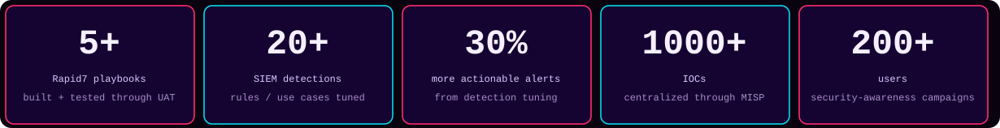

  
    
  

I work in a SOC at a managed security services provider, so my days are spent deciding which alerts are real across customer environments. I triage in Microsoft Sentinel, FortiSIEM and Rapid7 InsightIDR, escalate what's confirmed, and spend the rest of my time making the next alert easier to judge: tuning detections, automating repetitive steps and feeding threat intel back into the pipeline.

<a href="https://tharunshamalan.netlify.app">Portfolio</a> · <a href="https://linkedin.com/in/tharun-shamalan">LinkedIn</a> · <a href="https://github.com/Tharunehh">GitHub</a>

## What I do at work

**Investigation.** Alert triage, phishing analysis, malware investigation and IOC validation. Participated in a client ransomware investigation by rebuilding the attack timeline, tracing lateral movement and identifying ransom-note artifacts.

**Automation.** Selected for a security automation project and built Rapid7 playbooks from development through testing and UAT sign-off.

**Detection.** Tuned SIEM correlation rules and detection use cases to improve alert quality and reduce false positives.

**Threat intel and awareness.** Set up MISP as a shared threat-intelligence platform and ran GoPhish awareness campaigns with recommendations based on user response.

I also write recurring security reports covering alerts, trends and where customer posture can improve.

## Lab projects

I build these to practice what I don't get to touch every day. Each repository is a focused security exercise with implementation details and evidence.

<table>
<tr><td width="34%"><h3><a href="https://github.com/Tharunehh/Azure-Sentinel-Honeypot-Lab">Azure Sentinel Honeypot Lab</a></h3>Cloud attack telemetry</td><td>A Windows VM exposed to the internet to capture real RDP brute-force attempts. Logs flow through Log Analytics into Sentinel, with PowerShell-based attacker-IP geolocation and map visualization.  PowerShell · ★ 0</td></tr>
<tr><td width="34%"><h3><a href="https://github.com/Tharunehh/Endpoint-security-wazuh-lab">Wazuh Endpoint Security Lab</a></h3>Endpoint detection</td><td>SSH monitoring, file-integrity monitoring, safe EICAR malware validation, dashboards and MITRE ATT&amp;CK mapping, with extensive evidence screenshots.  Security · ★ 0</td></tr>
<tr><td width="34%"><h3><a href="https://github.com/Tharunehh/Api-Security-From-Scratch">API Security From Scratch</a></h3>API defense lifecycle</td><td>A FastAPI service hardened in phases: OAuth2/JWT authentication, bcrypt passwords, RBAC, rate limiting and SIEM-shaped security events.  Python · ★ 0</td></tr>
<tr><td width="34%"><h3><a href="https://github.com/Tharunehh/Powershell-loader-Vidar-Analysis">PowerShell Loader — Vidar-style Analysis</a></h3>Malware analysis</td><td>A fake-CAPTCHA clipboard-injection chain analyzed from obfuscated PowerShell loader through payload delivery, behavioral validation and ATT&amp;CK mapping.  HTML · ★ 1</td></tr>
<tr><td width="34%"><h3><a href="https://github.com/Tharunehh/rek">REK</a></h3>Recon automation</td><td>A reconnaissance playbook pipeline spanning enumeration, permutation, DNS resolution, HTTP probing, port scanning, content discovery, JavaScript analysis and reporting.  Recon automation</td></tr>
<tr><td width="34%"><h3><a href="https://github.com/Tharunehh/nudenet">NudeNet</a></h3>ML + security tooling</td><td>An enhanced Node.js/browser NSFW detection stack with an API, web dashboard, batch processing and image blurring.  ML + security tooling</td></tr>
</table>

## Focus areas

- **Alert Triage**  
- **Detection Engineering**  
- **Threat Hunting**  
- **Incident Response**  
- **Security Automation**  
- **Threat Intelligence**

## Tools I use

                   

## Credentials

- **Microsoft Certified: Security Operations Analyst Associate (SC-200)** — September 2026
- **FortiSIEM Certified Professional / FortiEDR Certified Professional** — Fortinet · 2025
- **AWS Cloud Practitioner Essentials** — 2023
- **B.Tech in Computer Science Engineering (Cyber Security and IoT)** — Sri Ramachandra Faculty of Engineering and Technology · 2025

- **Best Employee of the Month** — July 2025 · investigation accuracy and client communication

## Live GitHub telemetry

- **5** owned public repositories
- **0** followers
- **1** total stars across owned non-fork repositories
- **0** forks across owned non-fork repositories
- **JavaScript, HTML, Python, PowerShell** primary languages
- Last repository activity observed: **2026-09-28**

This profile is generated automatically from GitHub data.

