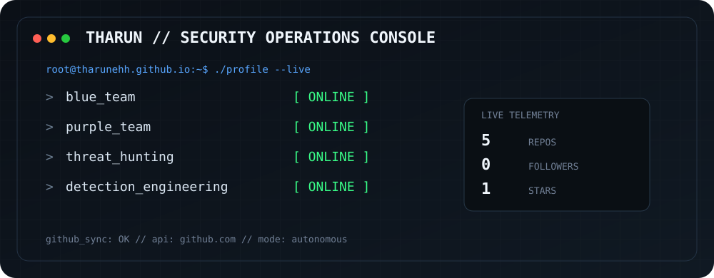

# Tharun Shamalan

> **Security Operations Analyst** · India

## Security Focus

- Blue Team
- Purple Team
- Threat Hunting
- Detection Engineering

## Security Stack

Microsoft Sentinel · Microsoft Defender XDR · KQL · Wazuh · Python · PowerShell · Linux · SIEM

## Live GitHub Profile

- Public repositories: **5**
- Followers: **0**
- Total stars across owned non-fork repositories: **1**
- Languages detected: **JavaScript, HTML, Python, PowerShell**

## Selected Security Work

- [Azure-Sentinel-Honeypot-Lab](https://github.com/Tharunehh/Azure-Sentinel-Honeypot-Lab) — Hands-on SIEM project using Azure Sentinel. A honeypot VM is deployed in Azure to attract real-world cyber attacks. Logs are collected via Log Analytics and analyzed in Sentinel to detect threats, study attacker behavior, and simulate SOC workflows.
- [Endpoint-security-wazuh-lab](https://github.com/Tharunehh/Endpoint-security-wazuh-lab) — Practical Blue Team project demonstrating endpoint security monitoring and threat detection using Wazuh. Includes SSH logon monitoring, file integrity monitoring, and safe malware detection (EICAR) with dashboards, MITRE ATT&CK mapping, and simulation scripts for real-world scenarios.
- [Api-Security-From-Scratch](https://github.com/Tharunehh/Api-Security-From-Scratch) — A security-first API project demonstrating how real-world APIs evolve from insecure baselines to commercial-grade authentication, authorization and abuse prevention
- [Powershell-loader-Vidar-Analysis](https://github.com/Tharunehh/Powershell-loader-Vidar-Analysis) — Security project

## Certification

**Microsoft Certified: Security Operations Analyst Associate**  
Earned: **28 September 2026** · Expires: **29 September 2027**

---

Generated automatically from GitHub data by GitHub Actions.
