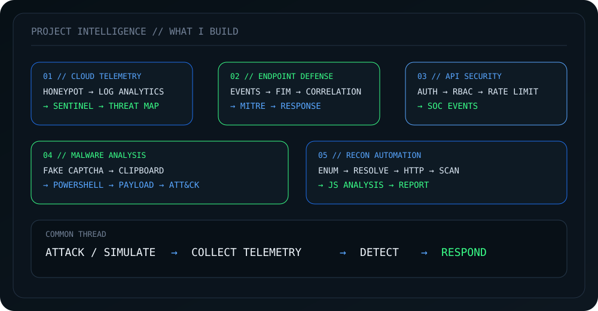

# Tharun Shamalan

### SECURITY OPERATIONS · BLUE TEAM · PURPLE TEAM

**Threat Hunting · Detection Engineering · SIEM**

---

## // OPERATING PROFILE

SOC • THREAT HUNTING • DETECTION ENGINEERING • INCIDENT RESPONSE

> Building practical security labs, detections, telemetry pipelines and defensive tooling.

### Core Stack

       

---

## // PROJECT INTELLIGENCE

## // LIVE TELEMETRY

---

## // SELECTED OPERATIONS

<table>
<tr>
<td width="50%" valign="top">

### [Azure Sentinel Honeypot Lab](https://github.com/Tharunehh/Azure-Sentinel-Honeypot-Lab)

Azure Sentinel + honeypot telemetry + Log Analytics + attacker behavior analysis.

</td>
<td width="50%" valign="top">

### [Wazuh Endpoint Security Lab](https://github.com/Tharunehh/Endpoint-security-wazuh-lab)

Endpoint monitoring, FIM, safe malware simulation, dashboards and MITRE ATT&CK mapping.

</td>
</tr>
<tr>
<td width="50%" valign="top">

### [API Security From Scratch](https://github.com/Tharunehh/Api-Security-From-Scratch)

Security-first API evolution covering authentication, authorization and abuse prevention.

</td>
<td width="50%" valign="top">

### [PowerShell Loader Analysis](https://github.com/Tharunehh/Powershell-loader-Vidar-Analysis)

PowerShell-focused security analysis and reverse-engineering work.

</td>
</tr>
</table>

---

## // LAB EVIDENCE

## // CERTIFICATION

**Microsoft Certified: Security Operations Analyst Associate**

Earned: **28 September 2026** · Expires: **29 September 2027**

---

### SYSTEM STATUS: ONLINE

BLUE TEAM · PURPLE TEAM · THREAT HUNTING · DETECTION ENGINEERING

Profile generated automatically from GitHub telemetry by GitHub Actions.

