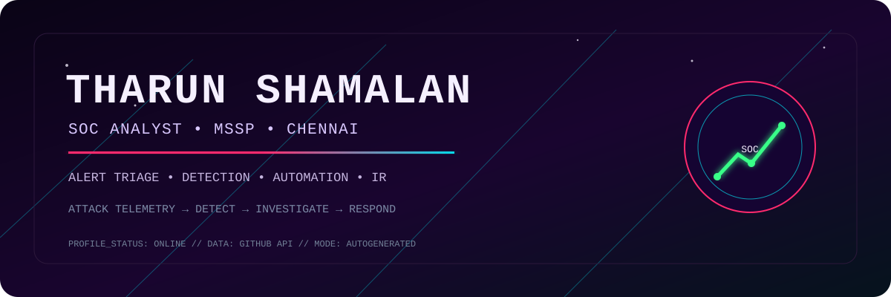
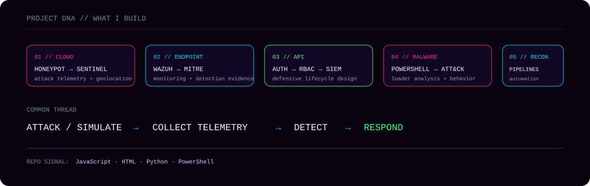
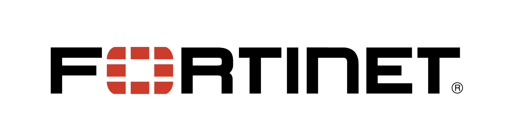
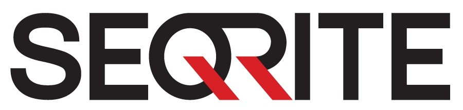
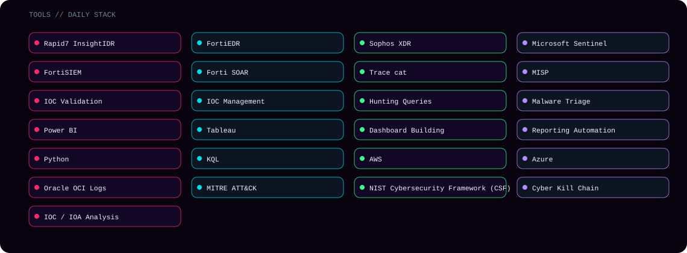

<a href="https://tharunshamalan.netlify.app/">Portfolio</a> • <a href="https://linkedin.com/in/tharun-shamalan">LinkedIn</a> • <a href="https://github.com/Tharunehh">GitHub</a>

## A bit about me

I work in an MSSP environment, investigating and triaging security alerts across customer environments. My day-to-day work includes phishing analysis, IOC validation, malware investigation, SIEM administration and log-source integration. The part I enjoy most is turning noisy telemetry into a useful explanation of what happened and what should happen next.

The projects below are where I practise the same cycle outside the SOC: create the activity, collect the evidence, work out what the telemetry is telling me, and turn that into something repeatable.

## What I work on

- **Security Operations**  
- **Incident Response**  
- **Threat Hunting**  
- **Detection Engineering**  
- **Malware Investigation**  
- **Threat Intelligence**

### A case I remember

A ransomware investigation was one of the cases that shaped how I think about SOC work. I worked backwards through logs from multiple security controls to reconstruct the attack timeline, trace lateral movement and validate attacker techniques, then built attack-path scenarios from the evidence.

### Day to day

- Investigating alerts across Microsoft Sentinel, FortiSIEM and Rapid7 InsightIDR.
- Running malware investigations, phishing analysis and IOC validation during incident triage.
- Building and testing Rapid7 automation playbooks to remove repetitive SOC work.
- Tuning SIEM correlation rules and detection use cases to reduce noise and improve alert quality.
- Using MISP to enrich and share threat intelligence, and using GoPhish campaign results to improve security awareness.

## Projects

| Project | Why it exists | Stack / ideas |
|---|---|---|
| [Azure Sentinel Honeypot Lab](https://github.com/Tharunehh/Azure-Sentinel-Honeypot-Lab) | A small cloud SOC built around a deliberately exposed Windows VM. It captures real RDP brute-force activity, pushes the telemetry into Log Analytics and Sentinel, enriches attacker IPs with geolocation and visualizes the result. | <code>Azure</code> <code>Sentinel</code> <code>PowerShell</code> <code>KQL</code> |
| [Endpoint Security Wazuh Lab](https://github.com/Tharunehh/Endpoint-security-wazuh-lab) | A defensive lab for endpoint visibility: SSH monitoring, file-integrity monitoring, suspicious-process detection, safe EICAR testing, dashboards and MITRE ATT&CK mapping. | <code>Wazuh</code> <code>FIM</code> <code>MITRE ATT&amp;CK</code> <code>Blue Team</code> |
| [API Security From Scratch](https://github.com/Tharunehh/Api-Security-From-Scratch) | An API that evolves from an unauthenticated baseline into a hardened design with OAuth2/JWT, RBAC, rate limiting, token protections and SIEM-ready security events. | <code>API Security</code> <code>JWT</code> <code>RBAC</code> <code>Rate Limiting</code> |
| [PowerShell Loader — Vidar-style Analysis](https://github.com/Tharunehh/Powershell-loader-Vidar-Analysis) | A fake-CAPTCHA clipboard attack chain analysed from user execution and obfuscated PowerShell through payload delivery and ATT&CK mapping. | <code>PowerShell</code> <code>Malware Analysis</code> <code>ATT&amp;CK</code> <code>CyberChef</code> |
| [REK](https://github.com/Tharunehh/rek) | A reconnaissance automation pipeline joining discovery, permutation, DNS resolution, HTTP probing, port scanning, content discovery, JavaScript analysis and reporting. | <code>Recon</code> <code>Automation</code> <code>Python</code> <code>Web Security</code> |
| [NudeNet](https://github.com/Tharunehh/nudenet) | An ML-powered Node.js/browser detection project with a REST API, web dashboard, batch processing and image blurring. | <code>Node.js</code> <code>TensorFlow.js</code> <code>Express</code> <code>ML</code> |

## Security vendor stack

 &nbsp; &nbsp; &nbsp;  &nbsp; &nbsp; &nbsp;  &nbsp; &nbsp; &nbsp; 

## Tech stack

## Education

B.Tech Computer Science Engineering (Cyber Security and IoT) • Sri Ramachandra Faculty of Engineering and Technology • 2021–2025 • CGPA 8.5/10

## Recognition

Best Employee of the Month • July 2025

---

This profile is generated from the profile configuration and public GitHub repository data. Vanity GitHub counts are intentionally omitted.

